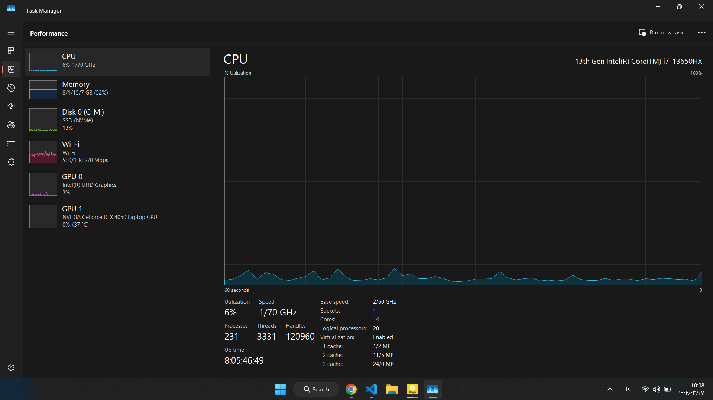
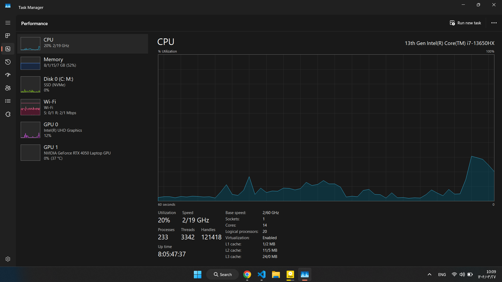
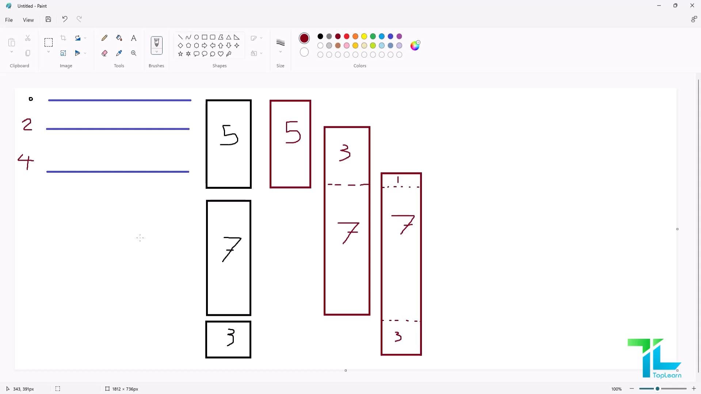
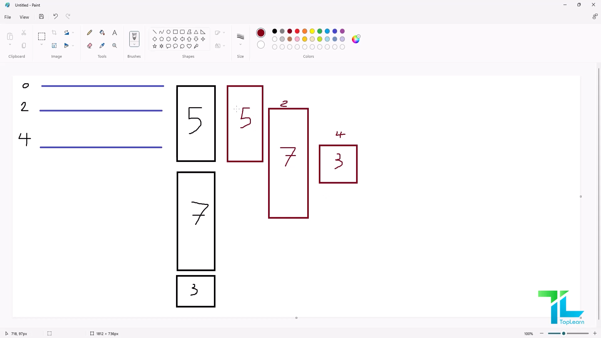
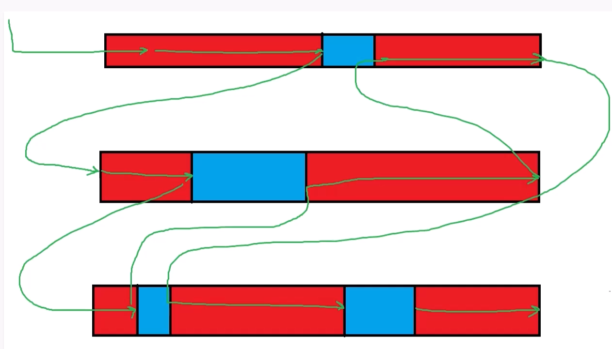

# آموزش Async در پایتون

## پیش نیازها: پایتون 3.5 به بعد

### جلسه 2
کد زیر رو در نظر بگیرید:
```python
x = 10
while True:
  x += 1
  print(x)
```

### عکس قبل از اجرا


### عکس هنگام اجرا


نکته قابل توجه این است که بعد از اجرا این حلقه بی نهایت, سیستم از تمام ظرفیت پردازشی خود استفاده نکرده است.
از 14 هسته CPU تنها 1 هسته درگیر پردازش میشود.

هنگامی که از برنامه نویسی Async استفاده میکنیم, سرعت به اندازه تعداد هسته های CPU ما افزایش پیدا نمیکند! بلکه بخش هایی از فرآیند عملیات ها که میتوانند موازی انجام شوند, موازی با فرآیند اصلی انجام میشوند.

برای مثال هنگامی که در یک سایت فروشگاهی شما صفحه محصولی را باز میکند و آن را به سبد خرید خود اضافه میکنید و سپس به درگاه پرداخت میروید تا پرداخت کنید؛ در این فرآیند هیچ بخشی نمیتواند موازی انجام شود، بلکه باید به ترتیب انجام شود.

ولی کارهایی مانند ارسال ایمیل یا پیامک تایید پرداخت و... را میتوانید موازی با فرآیند ثبت سفارش انجام دهید.

### جلسه 3
## Sync VS Async



درحالت sync هنگامی که یک تسک درحال اجرا است، اگر تسک دیگری وارد بشود، باید منتظر بماند تا فرآیند تست قبلی انجام شود تا نوبت به انجام آن برسد.

اما در برنامه نویسی Async هنگامی که یک تسک شروع میشود در فضای ThreadPool رها میشود تا انجام شود. درهمین هنگام سراغ تسک بعدی میرود.

### جلسه 4
## GIL -> Global Interpreter Lock

برای درک عمیق راجب GIL میتوانید از [این مقاله](https://realpython.com/python-gil/) استفاده کنید.


### نحوه کار async در یک Thread پایتون !



توجه کنید که این فرآیند برای یک Thread در پایتون انجام میشود !

نکته مهم در این موضوع این است که هرکدام از هسته های CPU میتواند خود به این صورت کار کنند.

### جلسه 5
با استفاده از Generator ها در زبان پایتون میتوانیم منتظر اتمام فرآیند یک تابع نمانیم و در هر مرحله نتیجه را yeald کنیم.
