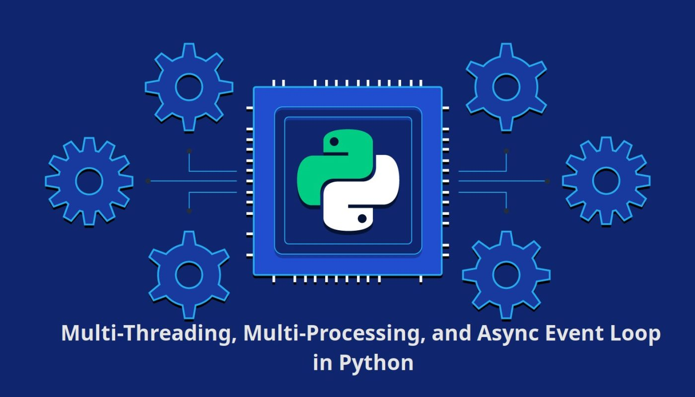

# راهنمای جامع برنامه‌نویسی Async و Parallel در پایتون 🏃📈✅



## مقدمه

این داکیومنت به منظور آموزش مفاهیم برنامه‌نویسی همزمانی (Async) و موازی‌سازی (Parallel) در زبان برنامه‌نویسی پایتون تدوین شده است. مطالب این سند بر اساس دوره آموزشی استاد اردوخانی در وب‌سایت تاپ لرن، [آموزش جامع Async و Parallel در Python](https://toplearn.com/c/6140)، تهیه شده است. هدف این داکیومنت فراهم آوردن درک عمیق‌تری از تکنیک‌ها و ابزارهای مرتبط با Async و Parallel در پایتون می‌باشد.

در این داکیومنت، به تشریح مفاهیم پایه، تکنیک‌های برنامه‌نویسی، و ارائه مثال‌های عملی پرداخته خواهد شد تا شما بتوانید در پروژه‌های واقعی خود به‌طور مؤثری از این مفاهیم بهره‌برداری کنید. 

بدیهی است که برای درک بهتر مطالب، داشتن دانش اولیه از زبان پایتون و تکنیک‌های برنامه‌نویسی بسیار کمک‌کننده خواهد بود. 

آموزش Async می‌تواند به بهبود کارایی برنامه‌ها و افزایش سرعت اجرای فرآیندهای همزمان کمک کند، به خصوص در پروژه‌هایی که شامل ورودی/خروجی غیرهمزمان و بارهای I/O-bound هستند.

امیدواریم که با مطالعه این داکیومنت، توانایی‌های برنامه‌نویسی خود را در زمینه Async و Parallel توسعه دهید و از مزایای بالای این تکنیک‌ها در پروژه‌های خود بهره‌مند شوید.

---

### پیش نیاز: پایتون 3.5 به بعد

---
### جلسه 2
کد زیر رو در نظر بگیرید:
```python
x = 10
while True:
  x += 1
  print(x)
```

### عکس قبل از اجرا


### عکس هنگام اجرا


نکته قابل توجه این است که بعد از اجرا این حلقه بی نهایت, سیستم از تمام ظرفیت پردازشی خود استفاده نکرده است.
از 14 هسته CPU تنها 1 هسته درگیر پردازش میشود.

هنگامی که از برنامه نویسی Async استفاده میکنیم, سرعت به اندازه تعداد هسته های CPU ما افزایش پیدا نمیکند! بلکه بخش هایی از فرآیند عملیات ها که میتوانند موازی انجام شوند, موازی با فرآیند اصلی انجام میشوند.

برای مثال هنگامی که در یک سایت فروشگاهی شما صفحه محصولی را باز میکند و آن را به سبد خرید خود اضافه میکنید و سپس به درگاه پرداخت میروید تا پرداخت کنید؛ در این فرآیند هیچ بخشی نمیتواند موازی انجام شود، بلکه باید به ترتیب انجام شود.

ولی کارهایی مانند ارسال ایمیل یا پیامک تایید پرداخت و... را میتوانید موازی با فرآیند ثبت سفارش انجام دهید.

---
### جلسه 3
### Sync VS Async


درحالت sync هنگامی که یک تسک درحال اجرا است، اگر تسک دیگری وارد بشود، باید منتظر بماند تا فرآیند تست قبلی انجام شود تا نوبت به انجام آن برسد.

اما در برنامه نویسی Async هنگامی که یک تسک شروع میشود در فضای ThreadPool رها میشود تا انجام شود. درهمین هنگام سراغ تسک بعدی میرود.

---
### جلسه 4
### GIL (Global Interpreter Lock)

برای درک عمیق راجب GIL میتوانید از [این مقاله](https://realpython.com/python-gil/) استفاده کنید.


### نحوه کار async در یک Thread پایتون !


توجه کنید که این فرآیند برای یک Thread در پایتون انجام میشود !

نکته مهم در این موضوع این است که هرکدام از هسته های CPU میتواند خود به این صورت کار کنند.

---
### جلسه 5
با استفاده از Generator ها در زبان پایتون میتوانیم منتظر اتمام فرآیند یک تابع نمانیم و در هر مرحله نتیجه را yeald کنیم.

به این کد توجه کنید:

```python
def fib():
  # 0, 1, 1, 2, 3, 5, ...

  current, nxt = 0, 1
  while True:
    current, nxt = nxt, current + nxt
    yield current

result = fib()

for item in result:
  if item > 1000:
    break
  
  print(item, end=", ")
```

خروجی این کد به صورت زیر است:

```bash
1, 1, 2, 3, 5, 8, 13, 21, 34, 55, 89, 144, 233, 377, 610, 987, 
```

در پایتون، Generatorها توابعی هستند که به جای بازگرداندن یک مقدار با استفاده از return، میتوانند در هر فراخوانی خروجی همان مرحله را محاسبه و بازگرداندن.

نکته مهم در استفاده از Generatorها این است که Generatorها مقدار مرحله قبل را در خود ذخیره میکنند.

برای استفاده از Generatorها میتوانیم به دو صورت عمل کنیم:

1- با استفاده از دستور `()next`
```python
result = fib()

print(next(result))
```

```bash
> 1
```

2- فراخوانی در یک حلقه
```python
result = fib()

for item in result:
    print(item, end=", ")
```

```bash
> 1, 1, 2, 3, ...
```

#### دلیل اهمیت Generatorها در مبحث Async:
یکی از خصوصیات اصلی که پکیج AsyncIo در پس زمینه از آن استفاده میکند، مبحث Generatorها است. به همین دلیل درک ساختار Generatorها از اهمیت بالایی برخوردار است.

---
### جلسه 7

در اینجا یک تسک را به صورت sync و async پیاده سازی کرده ایم.
در این مثال سعی کرده ایم فرآیند اسکرپ کردن دیتا از سایت را شبیه سازی کنیم.

[مشاهده کد sync](./codes/sync_scraper_task.py)

[مشاهده کد async](./codes/async_scraper_task.py)

مدت زمان انجام این تسک به صورت sync برابر با 24 ثانیه بود اما انجام این تسک به صورت async در 13 ثانیه انجام شده است.

این اختلاف به این دلیل است که در روش sync باید ابتدا همه url ها اسکرپ بشود و در یک لیست ذخیره شود؛ سپس فرآیند پردازش آن انجام شود.

اما در روش async همزمان با اسکرپ کردن یک صفحه، پردازش آن نیز انجام میشود.

نکات قایل توجه در کد async:


1- در `print` یک `flush=True` قرارداده شده تا به سرعت پرینت شود.

2- با استفاده از `data = asyncio.Queue()` یک صف ایجاد میکنیم.

3- به صورت زیر توابع رو به تسک تبدیل میکنیم:
```python
task_1 = asyncio.create_task(scrap_data(20, data))
task_2 = asyncio.create_task(process_data(20, data))
```
توجه: برای تبدیل تابع به تسک، باید تابع async باشد. (در ابتدای آن async بگذارید)

4- با استفاده از `asyncio.gather()` تسک هارو اجرا میکنیم.

```python
await asyncio.gather(task_1, task_2)
```


5- برای کار با `asyncio.Queue()`ها از `put()` و `get()` استفاده میکنیم.

6- برای ایجاد `sleep` از `asyncio.sleep()` استفاده میکنیم.

7- برای اجرای این فایل به صورت async به صورت زیر عمل میکنیم:
```python
if __name__ == "__main__":
    asyncio.run(main())
```

8- از پایتون `3.10` به بعد، استفاده مستقیم از `get_event_loop()` توصیه نمی‌شود و ممکن است `DeprecationWarning` دریافت کنید. بهتر است از `asyncio.run(say_hello())` استفاده کنیم.

#### تفاوت `time.sleep()` و `asyncio.sleep()`
همانطور که گفتیم، در پایتون یک `Thread` وجود دارد که وظیفه انجام کدهارو برعهده دارد. هنگامی که کد به صورت sync نوشته میشود، این کد به صورت خط به خط اجرا میشود. هنگامی که کد به صورت async نوشته شود، در بخش هایی از کد (مانند اتصال به دیتابیس و یا خواندن فایل و...) این  `Thread` انجام این تابع رو رها میکنه و به سراغ تسک بعدی میرود. اگر در کد async از `time.sleep()` استفاده کنیم، هنگام مواجه شدن با آن، `Thread` منتظر میماند. اصطلاحا قفل میشود. بنابراین برای اینکه این صبرکردن در پس زمینه انجام شود، باید از `asyncio.sleep()` استفاده کنیم.

#### استفاده از await
در برنامه نویسی async نیاز داریم تا در بخش هایی از برنامه منتظر بمانیم تا نتیجه تابعی بازگردانده شود. اگر به صورت sync بنویسم، برنامه متوقف میشود تا این پردازش انجام شود. اگر به صورت async بنویسیم، باید از `await` استفاده کنیم تا برنامه منتظر انجام این تابع بماند **اما در بک گراند**! بنابراین در این حین `Thread` به انجام سایر تسک ها میپردازد.

فراموش نشود که استفاده از `await` تنها در توابع async قایل استفاده است.

---
### جلسه 8

با استفاده از پکیج `uvloop` میتوانیم سرعت اجرا کدهارو حدود 2 تا 4 برابر افزایش بدهیم. این پکیج با استفاده از زبان C پیاده سازی شده است. به صورت زیر میتوانیم از این پکیج استفاده کنیم.

```python
import asyncio
import uvloop

asyncio.set_event_loop_policy(uvloop.EventLoopPolicy())
```

البته این روش روی ویندوز اجرا نمیشود.

---
### جلسه 9

به جای استفاده از پکیج `requests` باید از `aiohttp` استفاده کنیم. این پکیج به صورت async پیاده سازی شده است.
برای استفاده از این پکیج باید به صورت context manager استفاده کنیم.

نمونه کد استفاده از `aiohttp`:
```python
import aiohttp

async def scrap_url():
	async with aiohttp.ClientSession() as session:
		async with session.get("url") as response:
			return await response.text()
```
[کد مربوط به اسکرپ سایت تاپ لرن به صورت async](./codes/async_scrap.py)

---
### جلسه 10
معرفی چند پکیج محبوب استفاده از async:

1- aiofiles   
2- umongo   
3- asyncpg  
4- asyncio-redis


### استفاده از `asyncio` یا `threads` ؟
اگر برای کاری که میخواهیم انجام بدهیم، پکیجی وجود دارد که به صورت async پیاده سازی شده باشد، حتما از asyncio استفاده کنیم.
برای مثال به جای استفاده از پکیج requests که به صورت sync است، میتوانیم از پکیج aiohttp استفاده کنیم که به صورت async است.

اما اگر پکیجی که میخواهیم از آن استفاده کنیم، جایگزین async ندارد، باید از `threads` استفاده کنیم.


### نحوه استفاده از `Threads`


---
### جلسه 11

نمونه کد پیاده سازی به روش `Threading`:
```python
import threading
import time

def main():
    t = threading.Thread(target=greeter, args=("Mohammad", ))
    t.start()
    print("Task Done !")
    

def greeter(name: str, count: int = 10):
    for i in range(count):
        print(f"{i + 1} - Hello {name}")
        time.sleep(1)
        
main()
```

در این کد Thread اصلی انجام میشود و در پس زمینه به صورت موازی تسک اجرا میشود.

اگر بخواهیم نخ اصلی منتظر تمام شدن نخ های دیگر بماند میتوانیم از دستور `t.join()` استفاده کنیم.

اگر بخواهیم تسک در بک گراند کاری را انجام بدهد، باید درون `threading.Thread()` از `daemon=True` استفاده کنیم.

ما میتوانیم به صورت زیر چند Thread ایجاد کنیم:
```python
def main():
    t1 = threading.Thread(target=greeter, args=("Mohammad", ))
    t2 = threading.Thread(target=greeter, args=("Ali", ))
    
    t1.start()
    t2.start()
    
    print("Task Done !")
```
به این سبک که در آن چند Thread ایجاد میشود، برنامه نویسی `multi-thread` می گویند.

اگر بخواهیم چندین Thread (مثلا 100 Thread) ایجاد کنیم، میتوانیم آنها را درون یک لیست اضافه کنیم و به صورت `List Comprehensions` ایجاد و اجرا کنیم. برای مثال داریم:

```python
def main():
    
    threads = [
    	threading.Thread(target=greeter, args=("Mohammad", )),
    	threading.Thread(target=greeter, args=("Ali", )) 
	]
    
    [t.start() for t in threads]
    
    [t.join() for t in threads]

    print("Task Done !")
```
---
### جلسه 12

اگر Thread هایی در پس زمینه ایجاد میکنید، میتوانید از این روش برای متوقف کردن آنها استفاده کنید.

[روش متوقف کردن Threadها](./codes/canceling_thread.py)

---
### جلسه 13

### نکته مهم در استفاده از روش های multi-thread و async !
روش هایی که تا الان بررسی کردیم، برای پردازش هایی مفید است که I/O bound هستند.
اگر بخواهیم مربع اعداد 1 تا 50.000.000 رو حساب کنیم، چون از نوع CPU bound است، تاثیری در افزایش سرعت اجرای محاسبات ندارد !

دلیل این اتفاق این است که مفسر پایتون در هر لحظه تنها یک عملیات را انجام میدهد و اگر multi-thread هم پیاده سازی شود، باز هم به ترتیب محاسبه میشود.

---
### جلسه 14

### آشنایی با مبحث مهم `race condition` !

کد زیر رو در نظر بگیرید:

[مثال رزرو صندلی و بروز race condition](./codes/race_condition.py)

خروجی کد بالا در مواقعی ممکن است به صورت زیر باشد:

```bash
2 seats booked successfully for Mohammad 

2 seats booked successfully for Ali

Available seats: -2
```

این مشکل به این دلیل رخ میدهد که دو thread همزمان قصد استفاده از یک منبع را دارند. توضیحات بیشتر توسط هوش مصنوعی در زیر آمده است:

```
زمانی اتفاق می‌افتد که چندین برنامه یا وظیفه (coroutine) همزمان به یک بخش مشترک از حافظه یا داده‌ها دسترسی داشته باشند و نتیجه نهایی بستگی به ترتیب اجرای آن‌ها دارد. این وضعیت ممکن است باعث مشکلات غیرقابل پیش‌بینی و خطاهای سخت شود.

مثلاً، اگر دو وظیفه بخواهند همزمان مقدار یک متغیر را تغییر دهند، ممکن است یکی مقدار قبلی را بخواند، قبل از به‌روزرسانی، وظیفه دیگر آن را تغییر دهد و در نتیجه، داده نادرستی حاصل شود.
```

---
### جلسه 15
### استفاده از `Lock` برای جلوگیری از `race condition`

برای اینکه همزمان چند thread به یک متغییر یا منبع دسترسی نداشته باشند که باعث بروز race condition شود، از lock استفاده میکنیم.

استفاده از lock باعث میشود تا بخشی از کد که برای تغییر یا مقداردهی یک متغییر است قفل شود و سایر thread ها به آن دسترسی نداشته باشند.

برای کار با Lock دو روش معرفی میشود که روش دوم پیشنهاد میشود.

### روش اول: استفاده به صورت دستی

```python
class Movie:
    def __init__(self):
        self.lock = threading.Lock()
    
    def booking(self, number_of_seats):
        global available_seats
        
        self.lock.acquire()
		
		try:
			if number_of_seats <= available_seats:
				print(f'{number_of_seats} seats booked successfully for {threading.current_thread().name} \n')
				available_seats -= number_of_seats

			elif number_of_seats > available_seats:
				print(f'{threading.current_thread().name}, number of seats that you want is greater than available seats')

			else:
				print('All seats are sold out')
				
		except Exception as e:
			print(e)
		
		finally:
			self.lock.release()
```
در این روش اگر فراموش شود که `lock` را `release` کنیم، برنامه `Deadlock` میشود.

### روش دوم: استفاده به صورت context manager
```python
class Movie:
    def __init__(self):
        self.lock = threading.Lock()
    
    def booking(self, number_of_seats):
        global available_seats
        
        with self.lock:		
			try:
				if number_of_seats <= available_seats:
					print(f'{number_of_seats} seats booked successfully for {threading.current_thread().name} \n')
					available_seats -= number_of_seats

				elif number_of_seats > available_seats:
					print(f'{threading.current_thread().name}, number of seats that you want is greater than available seats')

				else:
					print('All seats are sold out')
					
			except Exception as e:
				print(e)
```

---
### جلسه 16
زمانی که یک thread به دستور `self.lock.acquire()` میرسد، تمامی thread ها قفل میشوند؛ تا زمانی که آن thread دستور `self.lock.release()` را فراخوانی کند.

مشکلی که وجود دارد این است که اگر اتفاقی دو thread دقیقا همزمان به دستور `self.lock.acquire()` برسند، `Deadlock` اتفاق می افتد. زمانی که این اتفاق می افتد، سرور باید ری استارت شود تا بتواند دوباره شروع به کار کند.

دلیل این اتفاق این است که وقتی دو thread همزمان به دستور `self.lock.acquire()` می رسند، یک thread تمامی threadهای دیگر رو لاک میکند و thread دیگر این thread را لاک میکند.
در نتیجه این اتفاق، تمامی threadها لاک می شوند و `Deadlock` اتفاق می افتد. به زبان دیگر، دستور `self.lock.release()` هیچ وقت فراخوانی نمیشود تا thread ها از حالت لاک خارج شوند.

#### آشنایی با `RLock` (Reentrant Lock)
برای جلوگیری از این اتفاق، پیشنهاد میشود که از `RLock` (Reentrant Lock) استفاده شود.

تفاوت RLock این است که به thread این اجازه را میدهد که وارد instance که لاک کرده است وارد شود. بنابراین اگر یک instance توسط دو thread قفل شود، thread میتواند وارد آن شود و دستور `self.lock.release()` را برای آن فراخوانی کند.

نکته قابل توجه این است که به همان تعداد که دستور `self.lock.acquire()` وجود دارد، باید دستور `self.lock.release()` نیز وجود داشته باشد. هرچند پیشنهاد می‌شود که از `context manager` استفاده شود.

### تفاوت `Lock` و 'RLock'
1- در `Lock` هنگامی که شما دستور `acquire()` را فراخوانی میکنید، thread دیگری نمیتواند آن را فراخوانی کند. اما در `RLock` هر چندتا thread میتوانند این کار آن را فراخوانی کنند.

2- هنگامی که شما از `Lock` استفاده میکنید، هر thread میتواند متد `release()` رو فراخوانی کنه. اما در `RLock` هر thread که متد `acquire()` رو فراخوانی میکند، همان thread باید متد `release()` رو فراخوانی کنه.

3- سرعت `Lock` از `RLock` بیشتر است. (اما این تفاوت خیلی به چشم نمیاد. سخت نگیرید)

---
### جلسه 17
همانطور که توضیح دادیم، پایتون به دلیل طراحی ساختار GIL، تنها روی یک هسته CPU اجرا میشود. تا به اینجا مثال هایی که توضیح دادیم، سعی بر این داشت که با استفاده از روش های async و multi-threading استفاده بهینه تری از همان یک هسته CPU داشته باشیم تا فرآیند ها به صورت موازی انجام بشود.

در این جلسه قصد داریم که `multi process programming` را معرفی کنیم.

به این مثال توجه کنید:

[محاسبه sqrt اعداد 1 تا 50.000.000 به صورت multi-threading](./codes/compute_example.py)

در این مثال سعی کردیم sqrt اعداد 1 تا 50.000.000 را به روش multi-threading انجام بدهیم تا سرعت اجرای بیشتری داشته باشد. اما دیدیم که با وجود استفاده از multi-threading محاسبات در 8 ثانیه انجام شد و پیشرفتی نداشت.

دلیل این اتفاق این است که در پایتون به دلیل استفاده از ساختار GIL در هر لحظه تنها یک محاسبه انجام میشود. بنابراین اگر از multi-threading نیز استفاده کنیم، بهبودی نخواهد یافت.

به این ساختار توجه کنید:


در `multi process programming` ما سعی میکنیم به جای اینکه درون یک process، کارهای بیشتری انجام بدهیم، تعداد process بیشتری داشته باشیم.
به زبان دیگر از تعداد هسته های CPU بیشتری استفاده کنیم.

[محاسبه sqrt اعداد 1 تا 50.000.000 به صورت multi-process](./codes/multi_process_programming.py)

در این مثال ما از پکیج `multiprocessing` برای بدست آوردن هسته های CPU استفاده کردیم.

```python
processor_count = multiprocessing.cpu_count()
pool = multiprocessing.Pool()
tasks = []
for n in range(1, processor_count + 1):
    task = pool.apply_async(do_math, args=(50_000_000 * (n - 1) / processor_count, 50_000_000 * n / processor_count))
    tasks.append(task)

pool.close()
pool.join()
```

با استفاده از این روش سرعت انجام محاسبات از 8 ثانیه به 1.5 ثانیه کاهش پیدا کرد.

روش اجرای کد نیز قابل توجه است!
```python
pool.close()
pool.join()
```

---
### جلسه 18
در مثالی که جلسه پیش روی آن توضیح دادیم، خروجی برای ما Return نمیکرد.

برای اینکه بتوانیم نتیجه یک محاسبه رو بدست بیاریم، میتونیم به صورت زیر عمل کنیم:
```python
tasks = []
for n in range(1, processor_count + 1):
    task = pool.apply_async(do_math, args=(50_000_000 * (n - 1) / processor_count, 50_000_000 * n / processor_count))
    tasks.append(task)

.
.
.

for t in tasks:
    print(t.get())
```

---
### جلسه 19
تا اینجای کار ما به صورت دستی فرآیند های پردازش به صورت `multi process` و `multi thread` را پیاده سازی کردیم.

در آپدیت های اخیر پایتون یک API برای انجام این کار ایجاد شده است که راحت تر میتوانیم این کار رو انجام بدهیم.

برای استفاده از این API باید از پکیج `concurrent` استفاده کنیم.

نحوه استفاده از این API را میتوانید در این کد مشاهده کنید:

[نحوه استفاده از پکیج concurrent](./codes/concurrent_futures.py)

---
